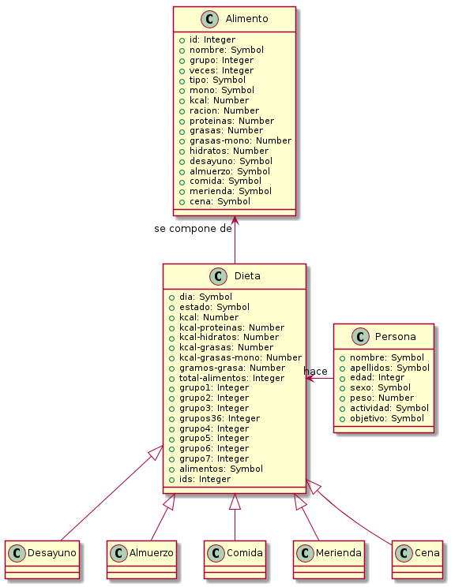
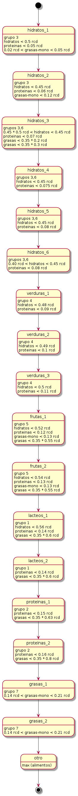

% Ingeniería y Gestión del Conocimiento: práctica 1
% Miguel Expósito Martín - 72056097H

# Introducción

El presente documento sintetiza las decisiones tomadas a la hora de llevar a cabo la presente práctica. Cabe destacar que, como autor de este material, es la primera vez que mantengo un contacto con un sistema basado en reglas en general y con el entorno CLIPS en particular.

# Entregables

- Directorio /md : código fuente de la memoria en [Markdown](http://markdown.es/).
- Directorio /png : imágenes asociadas a los diagramas.
- Directorio /uml: código fuente de los diagramas en [PlantUML](http://plantuml.com/).
- Directorio /ods: hoja de cálculo con alimentos en [Libreoffice](https://es.libreoffice.org/).
- Directorio /trazas: contiene las trazas obtenidas con el comando `dribble-on` para los cinco perfiles evaluados.
- Archivo hechos_iniciales.clp: plantillas y hechos iniciales necesarios para la ejecución de las reglas.
- Archivo dieta.clp: reglas que resuelven el problema en base a los hechos iniciales.

# Entorno y ejecución

Dada la similitud de la sintaxis de CLIPS con LISP, se optó por utilizar un Entorno Integrado de Desarrollo (IDE) para aprovechar funcionalidades como el resaltado de sintaxis. En concreto, se ha utilizado [IntelliJ IDEA](https://www.jetbrains.com/idea/) con un plugin de Clojure, cuya sintaxis es similar.

El código se ha ejecutado con éxito tanto en entornos Windows como en entornos Linux. Para replicar su ejecución, y suponiendo que el ejecutable de clips esté en la variable de entorno `$PATH` del sistema correspondiente, desde el directorio raíz de la práctica en el que se encuentran todos los fuentes, hay que ejecutar las siguientes acciones **en orden**:

        clips
        (load ./hechos_iniciales.clp)
        (load ./dieta.clp)
        (reset)
        (run)
        
Es decir, una vez en el entorno de CLIPS, primero se cargan las plantillas y hechos iniciales y posteriormente las reglas. Con el comando `reset()` se inicializa la base de datos de hechos y las reglas quedan listas para ejecutarse.        

# Enfoque

La planificación del desarrollo de la práctica se ha dividido en cuatro grandes bloques:

- Cálculo de los gastos energéticos y requerimiento calórico diario.
- Generación de combinaciones de alimentos (dietas) diarias.
- Reparto de alimentos de cada dieta en 5 comidas.
- Salida y entrada de datos.

La primera parte no revistió prácticamente dificultad, pudiéndose programar los cálculos en un tiempo razonable. En cambio, la generación de combinaciones de alimentos ha requerido de mucho tiempo y esfuerzo. La tercera parte presentó una dificultad media y la última fue muy sencilla.

# Modelo de conocimiento

El modelo utilizado para la práctica se ha simplificado al máximo de cara a minimizar cualquier complejidad derivada de su estructura a lo largo del desarrollo de la misma. Básicamente consta de las siguientes entidades principales:

- Persona: contiene los hechos asociados a una persona, introducidos por teclado.
- Alimento: contiene los hechos asociados a los distintos alimentos (calorías, proteinas, etc.); los datos se han obtenido de diversas fuentes en Internet [Ver referencia](). Todos los datos de macronutrientes y calorías están referidos a 100g de alimentos. Como parte de la información relativa a alimentos se encuentra el campo **ración**. Este **se ha completado con las cantidades normales para una dieta para adultos de en torno a 2000 kcal diarias**, con datos extraídos de diversos artículos sobre nutrición. A partir de ahí, se han añadido raciones mayores y menores con objeto de ofrecer más flexibilidad a la hora de seleccionar alimentos/raciones necesarios para la dieta.
- Dieta: contiene los hechos asociados a una dieta: sus calorías totales, proteinas totales, etc. así como los alimentos asociados. Las entidades de tipo dieta son generadas por el sistema, con lo que se trata de conocimiento adquirido a lo largo de la ejecución del programa.

Al margen de estas entidades, se tienen las derivadas de la dieta (desayuno, almuerzo, etc.) y otras auxiliares utilizadas fundamentalmente para llevar un control del día cuya dieta se está generando, alimentos repetidos entre días, etc.

En el diagrama de la figura 1 se clarifica la explicación anterior.

## Plantillas

Se han definido las siguientes plantillas:

- Alimento
- Persona
- Dieta
- Desayuno-dieta
- Almuerzo-dieta
- Comida-dieta
- Merienda-dieta
- Cena-dieta
- Usados
- Usados-reparto
- Dia

## Hechos iniciales

Junto con las plantillas están definidas las cargas de los siguientes hechos iniciales:

- Introducir-auxiliares
- Introducir-comidas
- Introducir-alimentos

Para generar los hechos asociados a los alimentos se ha utilizado una hoja de cálculo Libreoffice (incluida entre los entregables). Utilizando funciones de concatenación y sustitución, a partir de los datos sobre los alimentos distribuidos en columnas, se generan los hechos con la sintaxis correcta.

## Restricciones impuestas

- La suma total de calorias de la dieta debe ser inferior al requerimiento calórico diario.
- El requerimiento calórico diario se calcula como la suma del gasto energético basal y el gasto energético por actividad diaria.
- Los alimentos deberán repartirse en las siguientes raciones por grupos de alimentos:

        4-6 raciones/día de alimentos de los grupos 3 y 6
        2-4 raciones/día del grupo 4
        2-3 raciones del grupo 5
        2-3 raciones del grupo 1
        2-3 raciones del grupo 2
        40-60 gramos de grasa

- Las dietas que se generen tendrán que ser variadas.

- La contribución porcentual de macro-nutrientes a las calorías totales deberá ser aproximadamente de:

        50 − 55% carbohidratos
        30 − 35% grasas. (de las cuales, 15 − 20% monoinsaturados)
        10 − 15% proteínas.

# Sistema de reglas

## Entrada de datos

## Cálculo de gastos energéticos y requerimiento calórico diario

Esta fase no presentó mayores dificultades. Básicamente se han traducido los datos proporcionados en la tabla del enunciado por reglas que calculan los distintos valores en función de las edades y el sexo de los individuos. El enfoque ha consistido en crear una regla por cada combinación sexo-edad para calcular el gasto energético basal. Posteriormente, se calcula el gasto debido a la actividad en función de los datos introducidos y finalmente el requerimiento calórico diario con simples reglas.

## Primeros pasos en la generación de dietas

En primer lugar, se trató de plantear el problema siguiendo como modelo el número 11 de la colección de ejercicios resueltos (composición de programas musicales en emisoras de radio). Debido a mi conocimiento, formación y experiencia en lenguajes procedimentales y orientados a objetos, este enfoque resultó en un sesgo hacia que las reglas se ejecutaran como si de uno de estos lenguajes se trataran, lo cual resultó contraproducente. Se generaron muchas reglas, muchas variables de control por fases, muchas excepciones a los casos generales... pero no se consiguió llegar a una sóla solución del problema (dieta que cumpliera los requisitos diarios).

A continuación, pensando más detenidamente en el funcionamiento de un sistema basado en reglas, se optó por plantear el problema como si de una sentencia declarativa (similar a SQL, por ejemplo) con condiciones se tratara. Es decir, se intentó que el sistema proporcionara combinaciones de todos los alimentos posibles que satisfacieran las condiciones impuestas en cuanto a número de calorías y proporciones de proteínas, hidratos, etc. El problema contaba con un mínimo de doce variables o incógnitas, y al introduciras en una sola regla lo único que se conseguía era bloquear el sistema totalmente (e incluso la máquina en la que se ejecutaba).

## Algoritmo de generación de dietas

Finalmente, se trató de darle al problema el mismo enfoque que al "problema de la mochila". En este tercer planteamiento se tomó como base el número 13 de la colección de ejercicios resueltos (extracción de billetes de un cajero automático). El símil sería sencillo: los billetes equivaldrían a alimentos y los reintegros a las dietas. En resumidas cuentas el problema se planteaba también como un espacio de estados, donde los nodos serían las dietas. Existiría un operador por cada grupo de alimentos y su selección incrementaría las calorías totales en función de las raciones y los alimentos seleccionados. En el nodo final (o solución), la suma total de calorías equivaldría aproximadamente al requerimiento calórico diario con las restricciones impuestas. 

Tan sólo restaba establecer el criterio de decisión para "cerrar" un nodo. En principio se trató de maximizar el número de calorías, pero las combinaciones de alimentos resultantes estaban muy alejadas de las requeridas. Posteriormente se estableció como criterio maximizar el número de alimentos elegidos hasta la fecha en la dieta, lo que proporcionaba soluciones esporádicamente y con un rendimiento no aceptable (decenas de minutos).

A la vista de los resultados, se trató de "guiar" al algoritmo obligando a seleccionar determinados alimentos por fases. En este punto se probaron diversos criterios: elegir primero los alimentos proteicos, las grasas... ninguno conseguía que el algoritmo encontrara soluciones en tiempos razonables. Por ello, se optó por consultar un manual de alimentación y nutrición y documentación diversa sobre la confección de dietas ([referencias]()). En todos ellos se indicaba que **el primer grupo de alimentos que debe ser seleccionado es el de carbohidratos** y que, una vez alcanzado el requisito calórico de este macronutriente, se proporcionaría a su vez el 50% de las proteinas necesarias. Asimismo, en dicho manual se indica que se ha de seguir con verduras y frutas para terminar con lácteos y proteínas, quedando en último lugar las grasas. Este ha sido el criterio usado para guiar al algoritmo.

### Generación de dietas

Las dietas se generan a través de los distintos operadores, uno para cada grupo de alimento. Estos operadores seleccionan todas las posibles dietas en estado `cerrado`, es decir, que ya han sido seleccionadas previamente como candidatas prometedoras, y añaden un alimento de su grupo a la dieta computando los totales y subtotales de calorías, proteinas, hidratos, etc.

La generación de las nuevas dietas se realiza de forma que el alimento no se haya seleccionado ya en el mismo día. También se tienen en cuenta las periodicidades semanales introducidas en la base de hechos (una, dos, tres y cinco veces por semana). Asimismo, se incorporan a la selección las restricciones impuestas en el enunciado con objeto de que el espacio de posibles candidatos sea menor y por tanto mejore la eficiencia del algoritmo.

Las reglas de los distintos operadores se lanzan cuando se ha calculado el requerimiento calórico diario y existe una entidad de tipo dieta.

Hay que tener en cuenta que, si bien es posible seleccionar entre distintas raciones para un mismo alimento, esta selección solo puede llevarse a cabo una vez en el mismo día. Es decir, la ración escogida será la definitiva; a partir de ahí, el alimento pasará a estar en la lista de utilizados y no será reutilizable en dicha dieta.

### Selección de dietas
 
 Una vez generados los posibles nodos candidatos con dietas, se utilizan los siguientes criterios para seleccionar uno prometedor:
 
 - Primero, 2 alimentos del grupo 3. Con esto se pretende garantizar un mínimo de 2 raciones de legumbres semanales.
 - Segundo, 4 alimentos de los grupos 3 o 6. La selección de todos los carbohidratos está restringida a determinadas proporciones de proteínas, hidratos y grasas, encuadrándolos dentro de unos límites. Dichos límites han sido seleccionados de forma heurística, si bien se ha utilizado el sentido común (por ejemplo, en la selección del tercer alimento se restringe el número de calorías de carbohidratos a la mitad del máximo, dado que se está seleccionando la mitad de los alimentos de dicho grupo. 
 - Tercero, 3 alimentos del grupo 4 (verduras). En este caso sólo era necesario prestar atención a los límites máximos de hidratos y proteínas.
 - Cuarto, 2 alimentos del grupo 5 (frutas). Ídem que anterior.
 - Quinto, 2 alimentos del grupo 1 (lácteos). En este caso se vigilan las proteínas.
 - Sexto, 2 alimentos del grupo 2 (carne, huevos, pescado). Ídem que anterior.
 - Séptimo, 1 ó 2 alimentos del grupo 7 (grasas), siempre comprobando que la cantidad de monoinsaturadas se encuentre dentro de los límites indicados en el enunciado.
 
 Las dietas se seleccionan cambiando su estado a `cerrado`, para que sean explotadas en la siguiente iteración.
 
### Diagrama de estados
 
 A continuación se puede visualizar más cómodamente la descripción anterior en un diagrama de estados.
 
 
 
### Identificación de la solución

Se trata una regla de alta prioridad (99) que comprueba si existen dietas que cumplan con los requisitos calóricos y de grupos de alimentos. No es necesario comprobar restricciones sobre los macronutrientes porque la forma de guiar al algoritmo garantiza que, una solución cercana al requisito calórico diario, los cumplirá. 

En caso de encontrarla, cambia su estado a `solucion` y añade sus alimentos al listado de alimentos usados, para poder ser comprobados en dietas posteriores.
 
## Otras consideraciones algorítmicas

### Control de flujo

EL control de flujo se realiza en base a dos técnicas:

- Variables de control
- Prioridades de reglas

En el primer caso se utilizan variables como `?rcd` o `?dia` como disparadores para las reglas de selección y reparto de alimentos, respectivamente.

El segundo caso se utiliza, por ejemplo, en la distribución de alimentos; estos se van repartiendo en un orden modelado por las distintas reglas a través de sus prioridades.

- Cálculo de gastos energéticos y requerimiento calórico diario: se disparan cuando existe una entidad de tipo persona.
- Generación de alimentos para la dieta: se disparan cuando se ha calculado el requerimiento calórico diario y existe una dieta en estado cerrado.
- Selección de alimentos para la dieta: tienen prioridad -10 y se disparan cuando se han generado todas las dietas y estas están en estado abierto.
- Distribución de alimentos en cinco comidas: se disparan cuando hay dietas en estado `solucion`. Se van ejecutando secuencialmente a través de sus prioridades (de 102 a 88).
- Salida por pantalla: con prioridad -100, se disparan después de que se han ejecutado todas las reglas de distribución de alimentos.
 
### Realización de dietas variadas

Para la realización de dietas variadas se ha incluido una columna en el modelo de alimentos llamada `veces`, que incluye el número de repeticiones semanales que puede darse para un alimento dado (1, 2, 3 y 5).

El criterio para asignar a los alimentos un número determinado de repeticiones se ha extraído de las distintas referencias sobre nutrición y dietas consultadas. Hay datos que son de sabiduría popular, como por ejemplo:

- El aceite de oliva se puede consumir a diario, y de hecho es recomendable
- Es recomendable comer legumbres al menos dos veces por semana
- Es recomendable pescado entre dos o tres veces por semana
- Las verduras pueden tomarse todos los días de la semana
- Etc.

Por otra parte, para que reducir repeticiones de alimentos entre un día y el siguiente, se han asociado los que se toman dos veces a la semana a los martes y jueves y los que se toman tres veces a la semana a los lunes, miércoles y viernes. Los alimentos que se van utilizando en todas las dietas se almacenan en un hecho específico. 

Finalmente, en el mismo día no se pueden repetir alimentos (se realiza una comprobación en la selección de los mismos contra un hecho de tipo multislot que contiene los alimentos asociados a la dieta en cuestión).

### Distribución de calorías en cinco comidas diarias

Para distribuir los alimentos de la dieta diaria en cinco comidas se han seguido los siguientes criterios extraídos de las referencias documentales:
 
#### Reparto de calorías:
 
 - Desayuno: 30%
 - Almuerzo y merienda: 10% cada uno
 - Comida y cena: complementarios, tratando de ser la cena más ligera
 
#### Inclusión de alimentos según grupo con carácter de mínimo
 
 - Desayuno: lácteos y carbohidratos
 - Almuerzo y merienda: fruta
 - Comida: proteinas, legumbres, carbohidratos, verduras y grasa
 - Cena: resto
 
#### Preferencias del usuario

Se han incluido cinco columnas en la base de datos de alimentos indicando si ese alimento sería del gusto del autor 
para ser consumidos en la comida correspondiente (ejemplo: desayuno (si/no)). Esta información también se tiene en 
cuenta a la hora de la selección. Para garantizar que no quede ningún alimento fuera del reparto, la solución más 
sencilla es permitir que en la cena se pueda consumir todo tipo de alimentos, ya que además es la última comida del día y a la que probablemente lleguen menos calorías se asignen.
 
### Márgenes de error
 
Las distribuciones de calorías y alimentos no son exactas. Esto se debe al carácter aproximado de la disciplina de la nutrición en general, tal y como se expone en el enunciado de la práctica, y de cara a la realización de las dietas se ha impulsado conscientemente. Por ejemplo:

- Los límites calóricos superiores están calculados frente al requisito calórico diario y se ha dejado cierta holgura (56% en vez de 55%, por ejemplo). Esto hace que, a la hora de calcular las proporciones en la dieta real, los porcentajes puedan ser ligeramente superiores sin suponer error o problema alguno.
- Algunos valores en la selección de alimentos no se han limitado conscientemente, para dejar cierta libertad al algoritmo.
- La distribución de alimentos en comidas no se ha llevado a cabo siguiendo unos porcentajes estrictos para poder encajar con mayor facilidad las combinaciones.
 
# Otras consideraciones

En el foro de la asignatura se han comentado situaciones anómalas, como la incapacidad para diseñar dietas con 40-60 g de grasa en menores de tres años. Es evidente que, en lactantes, tanto la grasa como el resto de macronutrientes se aportan a través de la leche materna. En cualquier caso, los valores manejados en el enunciado de la práctica se refieren a sujetos adultos según la literatura [Referencia](). Estos porcentajes cambian para menores de tres años (ver [Referencia]()).  Es por ello que no se plantea acción alguna en el programa, que debería usarse con sentido común y sólo para dietas a partir de los 4 años.

# Evaluación del funcionamiento del programa

## Perfil 1: varón adulto de 83 kg y actividad moderada cuyo objetivo es mantener
        
        CLIPS> (reset)
        CLIPS> (run )
        Nombre?
        Miguel
        Apellidos?
        Exposito Martin
        Edad?
        35
        Peso?
        83
        Sexo (masculino/femenino)? masculino
        Actividad (reposo/ligera/moderada/intensa)? moderada
        Objetivo (mantener/reducir)? mantener
        Dia lunes
        Desayuno
                  Alimento: requeson,15g,96 kcal
                  Alimento: miel,50g,300 kcal
                  Alimento: galleta-tipo-maria,30g,409 kcal
                  Alimento: margarina-ligera,10g,368 kcal
                  Alimento: aceite-de-oliva,30g,900 kcal
                  Alimento: almendra,20g,499 kcal
                  Subtotal Calorias:    29.5172648554348 %
        Almuerzo
                  Alimento: manzana,125g,45 kcal
                  Alimento: zanahoria,175g,37 kcal
                  Alimento: ciruela-pasa,50g,177 kcal
                  Subtotal Calorias:    8.9143246175776 %
        Comida
                  Alimento: pollo-pechuga,50g,113 kcal
                  Alimento: espinacas-cocidas,200g,134 kcal
                  Alimento: fideos-de-harina-integral,50g,359 kcal
                  Subtotal Calorias:    21.4454396527881 %
        Merienda
                  Alimento: naranja,175g,53 kcal
                  Subtotal Calorias:    3.94655660277003 %
        Cena
                  Alimento: merluza,80g,64 kcal
                  Alimento: pasta-seca-al-huevo,150g,368 kcal
                  Alimento: acelga,300g,25 kcal
                  Alimento: cuajada,200g,86 kcal
                  Subtotal Calorias:    36.1764142714295 %
        TOTAL
                 % proteinas: 15.1973278301385
                 % hidratos:  52.9353445524754
                 % grasas:    34.1690955896432
                   % monoinsaturadas: 15.4253983788269
                 Calorias:    2350.15kcal
                 Deficit calorico: -108.35kcal
                 Total alimentos: 17
        -------------------------------------------------------------
        Dia martes
        Desayuno
                  Alimento: queso-philadelphia,10g,200 kcal
                  Alimento: avena-copos,75g,383 kcal
                  Alimento: pan-integral,30g,230 kcal
                  Alimento: pan-tostado,30g,420 kcal
                  Alimento: avellana,15g,625 kcal
                  Subtotal Calorias:    26.444814198558 %
        Almuerzo
                  Alimento: pera,125g,58 kcal
                  Alimento: petit-suisse-sabores,45g,168 kcal
                  Subtotal Calorias:    6.57127010537992 %
        Comida
                  Alimento: lubina,80g,98 kcal
                  Alimento: mantequilla,40g,750 kcal
                  Alimento: puerro,200g,26 kcal
                  Alimento: copos-de-maiz,150g,372 kcal
                  Alimento: patatas-guisadas,175g,89 kcal
                  Subtotal Calorias:    50.7665002773156 %
        Merienda
                  Alimento: cereza,40g,65 kcal
                  Subtotal Calorias:    1.15363283416528 %
        Cena
                  Alimento: huevo-entero,125g,162 kcal
                  Alimento: tomate,500g,16 kcal
                  Alimento: lechuga,300g,19 kcal
                  Subtotal Calorias:    15.0637825845813 %
        TOTAL
                 % proteinas: 15.0886300610094
                 % hidratos:  53.6270660011093
                 % grasas:    33.4981697171381
                   % monoinsaturadas: 17.0256239600666
                 Calorias:    2253.75kcal
                 Deficit calorico: -11.9499999999998kcal
                 Total alimentos: 16
        -------------------------------------------------------------
        Dia miercoles
        Desayuno
                  Alimento: queso-fresco,20g,307 kcal
                  Alimento: trigo-inflado,75g,386 kcal
                  Alimento: pan-integral,30g,230 kcal
                  Alimento: galleta-tipo-maria,30g,409 kcal
                  Alimento: almendra,20g,499 kcal
                  Alimento: jamon-cocido,30g,120 kcal
                  Subtotal Calorias:    29.9098384145669 %
        Almuerzo
                  Alimento: sandia,300g,15 kcal
                  Subtotal Calorias:    1.9839957674757 %
        Comida
                  Alimento: salmon,125g,191 kcal
                  Alimento: nata-liquida,55g,422 kcal
                  Alimento: cebolla,125g,24 kcal
                  Alimento: arroz-blanco,150g,366 kcal
                  Alimento: garbanzos-cocidos,125g,90 kcal
                  Subtotal Calorias:    51.2466106738972 %
        Merienda
                  Alimento: manzana,200g,45 kcal
                  Subtotal Calorias:    3.96799153495139 %
        Cena
                  Alimento: calabacin,200g,12 kcal
                  Alimento: brecol,200g,31 kcal
                  Alimento: cuajada,240g,86 kcal
                  Subtotal Calorias:    12.8915636091087 %
        TOTAL
                 % proteinas: 15.8005422921764
                 % hidratos:  54.9901902431497
                 % grasas:    31.1368295747636
                   % monoinsaturadas: 13.8998743469347
                 Calorias:    2268.15kcal
                 Deficit calorico: -26.3499999999999kcal
                 Total alimentos: 16
        -------------------------------------------------------------
        Dia jueves
        Desayuno
                  Alimento: yogur-descr-saborizado,175g,34 kcal
                  Alimento: avena-copos,75g,383 kcal
                  Alimento: pan-integral,30g,230 kcal
                  Alimento: pan-tostado,30g,420 kcal
                  Alimento: avellana,15g,625 kcal
                  Subtotal Calorias:    27.4294839976693 %
        Almuerzo
                  Alimento: platano,125g,85 kcal
                  Alimento: lacon,25g,361 kcal
                  Subtotal Calorias:    8.48134320305587 %
        Comida
                  Alimento: mantequilla,40g,750 kcal
                  Alimento: cebolla,125g,24 kcal
                  Alimento: copos-de-maiz,150g,372 kcal
                  Alimento: patatas-guisadas,175g,89 kcal
                  Subtotal Calorias:    45.0503916956212 %
        Merienda
                  Alimento: cereza,40g,65 kcal
                  Alimento: huevo-entero,125g,162 kcal
                  Subtotal Calorias:    9.86252886462222 %
        Cena
                  Alimento: tomate,500g,16 kcal
                  Alimento: lechuga,300g,19 kcal
                  Alimento: petit-suisse-sabores,45g,168 kcal
                  Subtotal Calorias:    9.17625223903144 %
        TOTAL
                 % proteinas: 13.3543388652697
                 % hidratos:  53.403543604463
                 % grasas:    34.348468826208
                   % monoinsaturadas: 16.5619267539979
                 Calorias:    2316.85kcal
                 Deficit calorico: -75.0499999999997kcal
                 Total alimentos: 16
        -------------------------------------------------------------
        Dia viernes
        Desayuno
                  Alimento: queso-fresco,20g,307 kcal
                  Alimento: trigo-inflado,150g,386 kcal
                  Alimento: margarina-ligera,10g,368 kcal
                  Subtotal Calorias:    29.3515950069348 %
        Almuerzo
                  Alimento: pinya,175g,55 kcal
                  Alimento: pan-integral,30g,230 kcal
                  Alimento: apio,175g,22 kcal
                  Subtotal Calorias:    8.83105062413315 %
        Comida
                  Alimento: jamon-serrano,80g,136 kcal
                  Alimento: almendra,20g,499 kcal
                  Alimento: manteca-de-cerdo,30g,891 kcal
                  Alimento: cebolla,125g,24 kcal
                  Alimento: avena-copos,50g,383 kcal
                  Subtotal Calorias:    30.2271151178918 %
        Merienda
                  Alimento: manzana,200g,45 kcal
                  Alimento: galleta-tipo-maria,30g,409 kcal
                  Subtotal Calorias:    9.21896671289875 %
        Cena
                  Alimento: salchicha-frankfurt,50g,243 kcal
                  Alimento: brecol,200g,31 kcal
                  Alimento: judias-blancas-cocidas,125g,101 kcal
                  Alimento: cuajada,240g,86 kcal
                  Subtotal Calorias:    22.3712725381415 %
        TOTAL
                 % proteinas: 15.500173370319
                 % hidratos:  52.9022191400832
                 % grasas:    31.8639476421637
                   % monoinsaturadas: 13.6997226074896
                 Calorias:    2307.2kcal
                 Deficit calorico: -65.4000000000001kcal
                 Total alimentos: 17
        -------------------------------------------------------------
        TOTAL SEMANA
                 % proteinas: 14.9843860091683
                 % hidratos:  53.5640782526248
                 % grasas:    33.0128260888475
                   % monoinsaturadas: 15.3208479397361
                 Calorias:    11496.1 kcal
                 Deficit calorico: -287.100000000002 kcal
        -------------------------------------------------------------

## Perfil 2: mujer adulta de 64 kg y actividad ligera cuyo objetivo es reducir

        CLIPS> (reset)
        CLIPS> (run)
        Nombre?
        Pepita
        Apellidos?
        Perez Lopez
        Edad?
        38
        Peso?
        64
        Sexo (masculino/femenino)? femenino
        Actividad (reposo/ligera/moderada/intensa)? ligera
        Objetivo (mantener/reducir)? reducir
        Dia lunes
        Desayuno
                  Alimento: queso-fresco,20g,307 kcal
                  Alimento: miel,20g,300 kcal
                  Alimento: galleta-tipo-maria,30g,409 kcal
                  Alimento: margarina-ligera,20g,368 kcal
                  Alimento: almendra,10g,499 kcal
                  Alimento: jamon-cocido,15g,120 kcal
                  Subtotal Calorias:    25.9139784946237 %
        Almuerzo
                  Alimento: manzana,100g,45 kcal
                  Alimento: espinacas-cocidas,50g,134 kcal
                  Alimento: zanahoria,50g,37 kcal
                  Subtotal Calorias:    8.77016129032258 %
        Comida
                  Alimento: merluza,80g,64 kcal
                  Alimento: aceite-de-oliva,20g,900 kcal
                  Alimento: acelga,150g,25 kcal
                  Alimento: fideos-de-harina-integral,30g,359 kcal
                  Alimento: ciruela-pasa,50g,177 kcal
                  Subtotal Calorias:    31.2432795698925 %
        Merienda
                  Alimento: naranja,100g,53 kcal
                  Alimento: cuajada,100g,86 kcal
                  Subtotal Calorias:    9.34139784946236 %
        Cena
                  Alimento: pasta-seca-al-huevo,100g,368 kcal
                  Subtotal Calorias:    24.7311827956989 %
        TOTAL
                 % proteinas: 15.2849462365591
                 % hidratos:  53.5
                 % grasas:    33.6199596774194
                   % monoinsaturadas: 15.2056451612903
                 Calorias:    1488.0kcal
                 Deficit calorico: -60.7800000000002kcal
                 Total alimentos: 17
        -------------------------------------------------------------
        Dia martes
        Desayuno
                  Alimento: requeson,75g,96 kcal
                  Alimento: avena-copos,25g,383 kcal
                  Alimento: pan-integral,30g,230 kcal
                  Alimento: pan-tostado,30g,420 kcal
                  Alimento: avellana,10g,625 kcal
                  Subtotal Calorias:    28.8412628437723 %
        Almuerzo
                  Alimento: sandia,100g,15 kcal
                  Alimento: jamon-cocido,15g,120 kcal
                  Alimento: huevo-entero,50g,162 kcal
                  Subtotal Calorias:    7.73169656482078 %
        Comida
                  Alimento: nata-liquida,55g,422 kcal
                  Alimento: puerro,75g,26 kcal
                  Alimento: copos-de-maiz,100g,372 kcal
                  Alimento: patatas-guisadas,100g,89 kcal
                  Subtotal Calorias:    48.329885720099 %
        Merienda
                  Alimento: cereza,40g,65 kcal
                  Alimento: petit-suisse-sabores,45g,168 kcal
                  Subtotal Calorias:    6.89070500864729 %
        Cena
                  Alimento: tomate,400g,16 kcal
                  Alimento: lechuga,300g,19 kcal
                  Subtotal Calorias:    8.20644986266066 %
        TOTAL
                 % proteinas: 15.0578181694869
                 % hidratos:  52.9214283292075
                 % grasas:    33.9258706636373
                   % monoinsaturadas: 18.9467258977924
                 Calorias:    1474.45kcal
                 Deficit calorico: -47.2299999999998kcal
                 Total alimentos: 16
        -------------------------------------------------------------
        Dia miercoles
        Desayuno
                  Alimento: queso-fresco,20g,307 kcal
                  Alimento: avena-copos,25g,383 kcal
                  Alimento: pan-integral,30g,230 kcal
                  Alimento: galleta-tipo-maria,30g,409 kcal
                  Alimento: margarina-ligera,20g,368 kcal
                  Subtotal Calorias:    28.5757770487368 %
        Almuerzo
                  Alimento: fresa,25g,35 kcal
                  Alimento: almendra,10g,499 kcal
                  Alimento: jamon-cocido,20g,120 kcal
                  Alimento: pollo-pechuga,50g,113 kcal
                  Subtotal Calorias:    9.41252071566273 %
        Comida
                  Alimento: aceite-de-oliva,20g,900 kcal
                  Alimento: cebolla,125g,24 kcal
                  Alimento: arroz-blanco,100g,366 kcal
                  Alimento: garbanzos-cocidos,125g,90 kcal
                  Subtotal Calorias:    46.5721919707782 %
        Merienda
                  Alimento: manzana,125g,45 kcal
                  Alimento: cuajada,100g,86 kcal
                  Subtotal Calorias:    9.62221395474685 %
        Cena
                  Alimento: calabacin,200g,12 kcal
                  Alimento: brecol,200g,31 kcal
                  Subtotal Calorias:    5.81729631007542 %
        TOTAL
                 % proteinas: 15.3387222241012
                 % hidratos:  50.9811614299726
                 % grasas:    34.2838299455474
                   % monoinsaturadas: 15.3049007339263
                 Calorias:    1478.35kcal
                 Deficit calorico: -51.1299999999999kcal
                 Total alimentos: 17
        -------------------------------------------------------------
        Dia jueves
        Desayuno
                  Alimento: yogur-descr-saborizado,150g,34 kcal
                  Alimento: avena-copos,25g,383 kcal
                  Alimento: pan-integral,30g,230 kcal
                  Alimento: pan-tostado,30g,420 kcal
                  Alimento: avellana,10g,625 kcal
                  Alimento: jamon-cocido,15g,120 kcal
                  Subtotal Calorias:    28.234704112337 %
        Almuerzo
                  Alimento: kiwi,125g,53 kcal
                  Alimento: mayonesa,10g,800 kcal
                  Subtotal Calorias:    9.77933801404213 %
        Comida
                  Alimento: jamon-serrano,50g,136 kcal
                  Alimento: mantequilla,30g,750 kcal
                  Alimento: cebolla,25g,24 kcal
                  Alimento: copos-de-maiz,100g,372 kcal
                  Alimento: patatas-guisadas,100g,89 kcal
                  Subtotal Calorias:    50.819124038783 %
        Merienda
                  Alimento: cereza,40g,65 kcal
                  Alimento: queso-philadelphia,10g,200 kcal
                  Subtotal Calorias:    3.07589434971581 %
        Cena
                  Alimento: tomate,400g,16 kcal
                  Alimento: lechuga,300g,19 kcal
                  Subtotal Calorias:    8.09093948512203 %
        TOTAL
                 % proteinas: 13.6409227683049
                 % hidratos:  53.353393513875
                 % grasas:    33.8756268806419
                   % monoinsaturadas: 18.7703109327984
                 Calorias:    1495.5kcal
                 Deficit calorico: -68.28kcal
                 Total alimentos: 17
        -------------------------------------------------------------
        Dia viernes
        Desayuno
                  Alimento: yogur-desnatado,50g,36 kcal
                  Alimento: trigo-inflado,75g,386 kcal
                  Alimento: avena-copos,30g,383 kcal
                  Alimento: jamon-cocido,20g,120 kcal
                  Subtotal Calorias:    29.8076923076923 %
        Almuerzo
                  Alimento: arandano,50g,41 kcal
                  Alimento: margarina-ligera,20g,368 kcal
                  Alimento: apio,175g,22 kcal
                  Subtotal Calorias:    8.85416666666667 %
        Comida
                  Alimento: filete-de-ternera,50g,131 kcal
                  Alimento: almendra,10g,499 kcal
                  Alimento: aceite-de-oliva,25g,900 kcal
                  Alimento: cebolla,125g,24 kcal
                  Alimento: pan-integral,30g,230 kcal
                  Subtotal Calorias:    29.3402777777778 %
        Merienda
                  Alimento: manzana,200g,45 kcal
                  Subtotal Calorias:    6.00961538461539 %
        Cena
                  Alimento: galleta-tipo-maria,30g,409 kcal
                  Alimento: brecol,175g,31 kcal
                  Alimento: judias-blancas-cocidas,125g,101 kcal
                  Alimento: cuajada,100g,86 kcal
                  Subtotal Calorias:    25.9882478632479 %
        TOTAL
                 % proteinas: 15.2283653846154
                 % hidratos:  52.8218482905983
                 % grasas:    33.7469951923077
                   % monoinsaturadas: 18.1129807692308
                 Calorias:    1497.6kcal
                 Deficit calorico: -70.3799999999999kcal
                 Total alimentos: 17
        -------------------------------------------------------------
        TOTAL SEMANA
                 % proteinas: 14.908459893192
                 % hidratos:  52.7182232744589
                 % grasas:    33.8896810557043
                   % monoinsaturadas: 17.2702081007277
                 Calorias:    7433.9 kcal
                 Deficit calorico: -297.799999999999 kcal
        -------------------------------------------------------------

## Perfil 3: varón adulto de 95 kg y actividad reposo cuyo objetivo es reducir

        CLIPS> (reset)
        CLIPS> (run)
        Nombre?
        Eduardo
        Apellidos?
        Grueso Fuerte
        Edad?
        70
        Peso?
        95
        Sexo (masculino/femenino)? masculino
        Actividad (reposo/ligera/moderada/intensa)? reposo
        Objetivo (mantener/reducir)? reducir
        Dia lunes
        Desayuno
                  Alimento: requeson,25g,96 kcal
                  Alimento: miel,20g,300 kcal
                  Alimento: pan-integral,30g,230 kcal
                  Alimento: galleta-tipo-maria,30g,409 kcal
                  Alimento: almendra,10g,499 kcal
                  Alimento: ciruela-pasa,50g,177 kcal
                  Alimento: jamon-cocido,30g,120 kcal
                  Subtotal Calorias:    26.9335487538521 %
        Almuerzo
                  Alimento: manzana,100g,45 kcal
                  Alimento: zanahoria,175g,37 kcal
                  Alimento: cuajada,50g,86 kcal
                  Subtotal Calorias:    9.14041229093738 %
        Comida
                  Alimento: merluza,80g,64 kcal
                  Alimento: nata-liquida,55g,422 kcal
                  Alimento: espinacas-cocidas,175g,134 kcal
                  Alimento: pasta-seca-al-huevo,125g,368 kcal
                  Subtotal Calorias:    58.5106064685995 %
        Merienda
                  Alimento: naranja,100g,53 kcal
                  Subtotal Calorias:    3.17146874906502 %
        Cena
                  Alimento: acelga,150g,25 kcal
                  Subtotal Calorias:    2.243963737546 %
        TOTAL
                 % proteinas: 15.1787691110912
                 % hidratos:  52.4345510576549
                 % grasas:    34.1926218472309
                   % monoinsaturadas: 16.09729826766
                 Calorias:    1671.15kcal
                 Deficit calorico: -78.5999999999999kcal
                 Total alimentos: 16
        -------------------------------------------------------------
        Dia martes
        Desayuno
                  Alimento: queso-philadelphia,10g,200 kcal
                  Alimento: miel,10g,300 kcal
                  Alimento: copos-de-maiz,100g,372 kcal
                  Alimento: pan-integral,30g,230 kcal
                  Subtotal Calorias:    29.4100029949087 %
        Almuerzo
                  Alimento: sandia,300g,15 kcal
                  Alimento: mayonesa,10g,800 kcal
                  Subtotal Calorias:    7.48727163821503 %
        Comida
                  Alimento: lubina,80g,98 kcal
                  Alimento: avellana,10g,625 kcal
                  Alimento: mantequilla,30g,750 kcal
                  Alimento: puerro,75g,26 kcal
                  Alimento: fideos-de-harina-integral,75g,359 kcal
                  Subtotal Calorias:    39.2123390236598 %
        Merienda
                  Alimento: cereza,40g,65 kcal
                  Alimento: huevo-entero,50g,162 kcal
                  Subtotal Calorias:    6.40910452231207 %
        Cena
                  Alimento: tomate,300g,16 kcal
                  Alimento: lechuga,300g,19 kcal
                  Alimento: patatas-guisadas,125g,89 kcal
                  Alimento: petit-suisse-sabores,45g,168 kcal
                  Subtotal Calorias:    17.4812818209045 %
        TOTAL
                 % proteinas: 15.0643905360886
                 % hidratos:  53.2734351602276
                 % grasas:    33.177897574124
                   % monoinsaturadas: 16.8140161725067
                 Calorias:    1669.5kcal
                 Deficit calorico: -76.95kcal
                 Total alimentos: 17
        -------------------------------------------------------------
        Dia miercoles
        Desayuno
                  Alimento: yogur-descr-saborizado,50g,34 kcal
                  Alimento: avena-copos,50g,383 kcal
                  Alimento: pan-integral,30g,230 kcal
                  Alimento: galleta-tipo-maria,30g,409 kcal
                  Alimento: margarina-ligera,20g,368 kcal
                  Subtotal Calorias:    28.6206167507324 %
        Almuerzo
                  Alimento: fresa,25g,35 kcal
                  Alimento: almendra,10g,499 kcal
                  Alimento: jamon-cocido,25g,120 kcal
                  Alimento: pollo-pechuga,50g,113 kcal
                  Subtotal Calorias:    8.76800869854118 %
        Comida
                  Alimento: aceite-de-oliva,20g,900 kcal
                  Alimento: cebolla,125g,24 kcal
                  Alimento: arroz-blanco,100g,366 kcal
                  Alimento: garbanzos-cocidos,125g,90 kcal
                  Subtotal Calorias:    41.5899000271829 %
        Merienda
                  Alimento: manzana,200g,45 kcal
                  Subtotal Calorias:    5.43658823884744 %
        Cena
                  Alimento: calabacin,200g,12 kcal
                  Alimento: brecol,200g,31 kcal
                  Alimento: cuajada,200g,86 kcal
                  Subtotal Calorias:    15.584886284696 %
        TOTAL
                 % proteinas: 15.3456764021867
                 % hidratos:  53.023649158839
                 % grasas:    32.1411096680661
                   % monoinsaturadas: 13.6675828324625
                 Calorias:    1655.45kcal
                 Deficit calorico: -62.8999999999999kcal
                 Total alimentos: 17
        -------------------------------------------------------------
        Dia jueves
        Desayuno
                  Alimento: yogur-desnatado,50g,36 kcal
                  Alimento: avena-copos,50g,383 kcal
                  Alimento: pan-integral,30g,230 kcal
                  Alimento: pan-tostado,30g,420 kcal
                  Alimento: avellana,10g,625 kcal
                  Alimento: jamon-cocido,15g,120 kcal
                  Subtotal Calorias:    29.6636085626911 %
        Almuerzo
                  Alimento: pera,100g,58 kcal
                  Alimento: manteca-de-cacao,10g,925 kcal
                  Subtotal Calorias:    9.20489296636086 %
        Comida
                  Alimento: huevo-entero,50g,162 kcal
                  Alimento: mantequilla,30g,750 kcal
                  Alimento: cebolla,25g,24 kcal
                  Alimento: copos-de-maiz,100g,372 kcal
                  Alimento: patatas-guisadas,125g,89 kcal
                  Subtotal Calorias:    48.6391437308869 %
        Merienda
                  Alimento: cereza,40g,65 kcal
                  Subtotal Calorias:    1.59021406727829 %
        Cena
                  Alimento: tomate,500g,16 kcal
                  Alimento: lechuga,300g,19 kcal
                  Alimento: leche-desnatada,125g,33 kcal
                  Subtotal Calorias:    10.9021406727829 %
        TOTAL
                 % proteinas: 12.519877675841
                 % hidratos:  54.5051987767584
                 % grasas:    34.348623853211
                   % monoinsaturadas: 17.1688073394495
                 Calorias:    1635.0kcal
                 Deficit calorico: -42.45kcal
                 Total alimentos: 17
        -------------------------------------------------------------
        Dia viernes
        Desayuno
                  Alimento: queso-fresco,20g,307 kcal
                  Alimento: trigo-inflado,100g,386 kcal
                  Alimento: margarina-ligera,10g,368 kcal
                  Subtotal Calorias:    29.5821114369501 %
        Almuerzo
                  Alimento: arandano,50g,41 kcal
                  Alimento: avena-copos,25g,383 kcal
                  Alimento: apio,175g,22 kcal
                  Subtotal Calorias:    9.45442326490714 %
        Comida
                  Alimento: jamon-serrano,50g,136 kcal
                  Alimento: almendra,10g,499 kcal
                  Alimento: aceite-de-oliva,30g,900 kcal
                  Alimento: cebolla,125g,24 kcal
                  Alimento: pan-integral,30g,230 kcal
                  Subtotal Calorias:    29.7470674486804 %
        Merienda
                  Alimento: manzana,200g,45 kcal
                  Alimento: jamon-cocido,20g,120 kcal
                  Subtotal Calorias:    6.96480938416422 %
        Cena
                  Alimento: galleta-tipo-maria,30g,409 kcal
                  Alimento: brecol,200g,31 kcal
                  Alimento: judias-blancas-cocidas,125g,101 kcal
                  Alimento: cuajada,100g,86 kcal
                  Subtotal Calorias:    24.2515884652981 %
        TOTAL
                 % proteinas: 15.4765395894428
                 % hidratos:  52.8787878787879
                 % grasas:    33.604288856305
                   % monoinsaturadas: 19.3218475073314
                 Calorias:    1636.8kcal
                 Deficit calorico: -44.25kcal
                 Total alimentos: 17
        -------------------------------------------------------------
        TOTAL SEMANA
                 % proteinas: 14.7222390207913
                 % hidratos:  53.2193180856082
                 % grasas:    33.4913339542084
                   % monoinsaturadas: 16.6057886524994
                 Calorias:    8267.9 kcal
                 Deficit calorico: -305.15 kcal
        -------------------------------------------------------------

## Perfil 4: niña de 18 kg y actividad moderada cuyo objetivo es mantener

        CLIPS> (reset)
        CLIPS> (run)
        Nombre?
        Lucia
        Apellidos?
        Infante Menor
        Edad?
        5
        Peso?
        18
        Sexo (masculino/femenino)? femenino
        Actividad (reposo/ligera/moderada/intensa)? intensa
        Objetivo (mantener/reducir)? mantener
        Dia lunes
        Desayuno
                  Alimento: requeson,25g,96 kcal
                  Alimento: miel,40g,300 kcal
                  Alimento: pan-integral,30g,230 kcal
                  Alimento: galleta-tipo-maria,30g,409 kcal
                  Alimento: almendra,20g,499 kcal
                  Alimento: ciruela-pasa,50g,177 kcal
                  Alimento: jamon-cocido,40g,120 kcal
                  Subtotal Calorias:    29.6211905440046 %
        Almuerzo
                  Alimento: sandia,300g,15 kcal
                  Alimento: zanahoria,175g,37 kcal
                  Alimento: cuajada,50g,86 kcal
                  Subtotal Calorias:    7.91020429300122 %
        Comida
                  Alimento: merluza,80g,64 kcal
                  Alimento: nata-liquida,55g,422 kcal
                  Alimento: espinacas-cocidas,200g,134 kcal
                  Alimento: pasta-seca-al-huevo,150g,368 kcal
                  Subtotal Calorias:    57.1347194531473 %
        Merienda
                  Alimento: naranja,100g,53 kcal
                  Subtotal Calorias:    2.74462080215427 %
        Cena
                  Alimento: acelga,200g,25 kcal
                  Subtotal Calorias:    2.58926490769271 %
        TOTAL
                 % proteinas: 15.613267393387
                 % hidratos:  53.5905336474975
                 % grasas:    33.692032831879
                   % monoinsaturadas: 16.3263509489656
                 Calorias:    1931.05kcal
                 Deficit calorico: -27.05kcal
                 Total alimentos: 16
        -------------------------------------------------------------
        Dia martes
        Desayuno
                  Alimento: queso-philadelphia,10g,200 kcal
                  Alimento: miel,10g,300 kcal
                  Alimento: pan-integral,20g,230 kcal
                  Alimento: mantequilla,40g,750 kcal
                  Alimento: avellana,15g,625 kcal
                  Subtotal Calorias:    24.6477101157524 %
        Almuerzo
                  Alimento: pera,100g,58 kcal
                  Alimento: petit-suisse-sabores,45g,168 kcal
                  Subtotal Calorias:    6.72370407649723 %
        Comida
                  Alimento: lubina,80g,98 kcal
                  Alimento: puerro,75g,26 kcal
                  Alimento: copos-de-maiz,150g,372 kcal
                  Alimento: patatas-guisadas,100g,89 kcal
                  Subtotal Calorias:    37.4886763965778 %
        Merienda
                  Alimento: cereza,40g,65 kcal
                  Subtotal Calorias:    1.30850528434826 %
        Cena
                  Alimento: huevo-entero,125g,162 kcal
                  Alimento: fideos-de-harina-integral,75g,359 kcal
                  Alimento: tomate,400g,16 kcal
                  Alimento: lechuga,300g,19 kcal
                  Subtotal Calorias:    29.8314041268244 %
        TOTAL
                 % proteinas: 15.1504781077001
                 % hidratos:  53.2269753397081
                 % grasas:    33.3751887267237
                   % monoinsaturadas: 19.3112732762959
                 Calorias:    1987.0kcal
                 Deficit calorico: -83.0kcal
                 Total alimentos: 16
        -------------------------------------------------------------
        Dia miercoles
        Desayuno
                  Alimento: queso-fresco,20g,307 kcal
                  Alimento: miel,50g,300 kcal
                  Alimento: pan-integral,30g,230 kcal
                  Alimento: galleta-tipo-maria,30g,409 kcal
                  Alimento: margarina-ligera,20g,368 kcal
                  Alimento: almendra,20g,499 kcal
                  Subtotal Calorias:    29.4884910485933 %
        Almuerzo
                  Alimento: pinya,175g,55 kcal
                  Alimento: cuajada,100g,86 kcal
                  Subtotal Calorias:    9.32225063938619 %
        Comida
                  Alimento: pollo-pechuga,125g,113 kcal
                  Alimento: aceite-de-oliva,20g,900 kcal
                  Alimento: cebolla,125g,24 kcal
                  Alimento: arroz-blanco,125g,366 kcal
                  Alimento: garbanzos-cocidos,100g,90 kcal
                  Subtotal Calorias:    45.9718670076726 %
        Merienda
                  Alimento: manzana,200g,45 kcal
                  Subtotal Calorias:    4.60358056265985 %
        Cena
                  Alimento: salchicha-frankfurt,50g,243 kcal
                  Alimento: calabacin,200g,12 kcal
                  Alimento: brecol,200g,31 kcal
                  Subtotal Calorias:    10.613810741688 %
        TOTAL
                 % proteinas: 15.1682864450128
                 % hidratos:  53.8404092071611
                 % grasas:    32.5173913043478
                   % monoinsaturadas: 13.939641943734
                 Calorias:    1955.0kcal
                 Deficit calorico: -51.0kcal
                 Total alimentos: 17
        -------------------------------------------------------------
        Dia jueves
        Desayuno
                  Alimento: yogur-descr-saborizado,50g,34 kcal
                  Alimento: avena-copos,50g,383 kcal
                  Alimento: pan-integral,30g,230 kcal
                  Alimento: pan-tostado,30g,420 kcal
                  Alimento: avellana,15g,625 kcal
                  Alimento: jamon-cocido,15g,120 kcal
                  Subtotal Calorias:    26.0477225620545 %
        Almuerzo
                  Alimento: platano,75g,85 kcal
                  Alimento: mayonesa,10g,800 kcal
                  Subtotal Calorias:    7.26707446539609 %
        Comida
                  Alimento: huevo-entero,125g,162 kcal
                  Alimento: mantequilla,30g,750 kcal
                  Alimento: cebolla,25g,24 kcal
                  Alimento: copos-de-maiz,150g,372 kcal
                  Alimento: patatas-guisadas,100g,89 kcal
                  Subtotal Calorias:    54.6231231990294 %
        Merienda
                  Alimento: cereza,40g,65 kcal
                  Alimento: petit-suisse-sabores,45g,168 kcal
                  Subtotal Calorias:    5.13624184823821 %
        Cena
                  Alimento: tomate,500g,16 kcal
                  Alimento: lechuga,300g,19 kcal
                  Subtotal Calorias:    6.92583792528184 %
        TOTAL
                 % proteinas: 13.0377635104393
                 % hidratos:  53.3825387998584
                 % grasas:    34.6150346291896
                   % monoinsaturadas: 15.6218088064304
                 Calorias:    1978.1kcal
                 Deficit calorico: -74.0999999999999kcal
                 Total alimentos: 17
        -------------------------------------------------------------
        Dia viernes
        Desayuno
                  Alimento: queso-fresco,20g,307 kcal
                  Alimento: trigo-inflado,100g,386 kcal
                  Alimento: pan-integral,30g,230 kcal
                  Alimento: margarina-ligera,10g,368 kcal
                  Alimento: jamon-cocido,15g,120 kcal
                  Subtotal Calorias:    28.6143672978659 %
        Almuerzo
                  Alimento: pinya,125g,55 kcal
                  Alimento: galleta-tipo-maria,30g,409 kcal
                  Subtotal Calorias:    9.59072237250776 %
        Comida
                  Alimento: filete-de-ternera,50g,131 kcal
                  Alimento: almendra,20g,499 kcal
                  Alimento: aceite-de-oliva,30g,900 kcal
                  Alimento: apio,175g,22 kcal
                  Alimento: avena-copos,75g,383 kcal
                  Subtotal Calorias:    38.1249373810239 %
        Merienda
                  Alimento: manzana,200g,45 kcal
                  Subtotal Calorias:    4.50856627592426 %
        Cena
                  Alimento: cebolla,125g,24 kcal
                  Alimento: brecol,175g,31 kcal
                  Alimento: judias-blancas-cocidas,125g,101 kcal
                  Alimento: cuajada,200g,86 kcal
                  Subtotal Calorias:    19.1614066726781 %
        TOTAL
                 % proteinas: 15.0606151688208
                 % hidratos:  52.9716461276425
                 % grasas:    33.9945897204689
                   % monoinsaturadas: 18.1605049594229
                 Calorias:    1996.2kcal
                 Deficit calorico: -92.2kcal
                 Total alimentos: 17
        -------------------------------------------------------------
        TOTAL SEMANA
                 % proteinas: 14.802154894464
                 % hidratos:  53.399544039767
                 % grasas:    33.6416396289357
                   % monoinsaturadas: 16.6850980212951
                 Calorias:    9847.35 kcal
                 Deficit calorico: -327.35 kcal
        -------------------------------------------------------------

## Perfil 5: mujer de 60 kg y actividad intensa cuyo objetivo es mantener

        CLIPS> (reset)
        CLIPS> (run)
        Nombre?
        Pilar
        Apellidos?
        Deportista Intensa
        Edad?
        30
        Peso?
        60
        Sexo (masculino/femenino)? femenino
        Actividad (reposo/ligera/moderada/intensa)? intensa
        Objetivo (mantener/reducir)? mantener
        Dia lunes
        Desayuno
                  Alimento: requeson,25g,96 kcal
                  Alimento: miel,50g,300 kcal
                  Alimento: galleta-tipo-maria,30g,409 kcal
                  Alimento: margarina-ligera,10g,368 kcal
                  Alimento: aceite-de-oliva,30g,900 kcal
                  Alimento: almendra,20g,499 kcal
                  Subtotal Calorias:    28.5557675910512 %
        Almuerzo
                  Alimento: manzana,125g,45 kcal
                  Alimento: zanahoria,175g,37 kcal
                  Alimento: ciruela-pasa,50g,177 kcal
                  Subtotal Calorias:    8.50623249015388 %
        Comida
                  Alimento: merluza,80g,64 kcal
                  Alimento: espinacas-cocidas,200g,134 kcal
                  Alimento: fideos-de-harina-integral,75g,359 kcal
                  Subtotal Calorias:    23.8925656746112 %
        Merienda
                  Alimento: naranja,175g,53 kcal
                  Alimento: jamon-cocido,40g,120 kcal
                  Subtotal Calorias:    5.71480774696496 %
        Cena
                  Alimento: pasta-seca-al-huevo,150g,368 kcal
                  Alimento: acelga,250g,25 kcal
                  Alimento: cuajada,240g,86 kcal
                  Subtotal Calorias:    33.3306264972187 %
        TOTAL
                 % proteinas: 14.9677209793333
                 % hidratos:  53.4256364448415
                 % grasas:    33.6627552884811
                   % monoinsaturadas: 14.7192334240123
                 Calorias:    2462.9kcal
                 Deficit calorico: -111.9kcal
                 Total alimentos: 17
        -------------------------------------------------------------
        Dia martes
        Desayuno
                  Alimento: queso-philadelphia,10g,200 kcal
                  Alimento: copos-de-maiz,150g,372 kcal
                  Alimento: pan-integral,30g,230 kcal
                  Subtotal Calorias:    27.5941485051393 %
        Almuerzo
                  Alimento: pera,125g,58 kcal
                  Alimento: pan-tostado,30g,420 kcal
                  Subtotal Calorias:    8.4659018211285 %
        Comida
                  Alimento: lubina,175g,98 kcal
                  Alimento: avellana,20g,625 kcal
                  Alimento: aceite-de-semillas,40g,900 kcal
                  Alimento: puerro,75g,26 kcal
                  Alimento: arroz-blanco,100g,366 kcal
                  Subtotal Calorias:    44.4406533884932 %
        Merienda
                  Alimento: cereza,40g,65 kcal
                  Alimento: huevo-entero,80g,162 kcal
                  Alimento: petit-suisse-sabores,45g,168 kcal
                  Subtotal Calorias:    9.8605365291935 %
        Cena
                  Alimento: tomate,500g,16 kcal
                  Alimento: lechuga,300g,19 kcal
                  Alimento: patatas-guisadas,100g,89 kcal
                  Subtotal Calorias:    9.63875975604555 %
        TOTAL
                 % proteinas: 15.147353606005
                 % hidratos:  54.9178999445558
                 % grasas:    31.5385763637139
                   % monoinsaturadas: 20.1825393440525
                 Calorias:    2344.7kcal
                 Deficit calorico: 6.30000000000018kcal
                 Total alimentos: 16
        -------------------------------------------------------------
        Dia miercoles
        Desayuno
                  Alimento: queso-fresco,20g,307 kcal
                  Alimento: trigo-inflado,150g,386 kcal
                  Subtotal Calorias:    27.1707079064045 %
        Almuerzo
                  Alimento: sandia,300g,15 kcal
                  Alimento: pan-integral,30g,230 kcal
                  Alimento: almendra,20g,499 kcal
                  Subtotal Calorias:    9.07104520672903 %
        Comida
                  Alimento: pollo-pechuga,75g,113 kcal
                  Alimento: manteca-de-cerdo,40g,891 kcal
                  Alimento: haba-fresca-cruda,75g,390 kcal
                  Alimento: cebolla,125g,24 kcal
                  Subtotal Calorias:    32.3999236301152 %
        Merienda
                  Alimento: manzana,200g,45 kcal
                  Alimento: galleta-tipo-maria,30g,409 kcal
                  Subtotal Calorias:    9.02437472156813 %
        Cena
                  Alimento: salchicha-frankfurt,50g,243 kcal
                  Alimento: calabacin,200g,12 kcal
                  Alimento: brecol,200g,31 kcal
                  Alimento: garbanzos-cocidos,125g,90 kcal
                  Alimento: cuajada,240g,86 kcal
                  Subtotal Calorias:    22.3339485351832 %
        TOTAL
                 % proteinas: 15.8229915780988
                 % hidratos:  51.0863616114046
                 % grasas:    31.9264303443009
                   % monoinsaturadas: 16.5722650035003
                 Calorias:    2356.95kcal
                 Deficit calorico: -5.95000000000027kcal
                 Total alimentos: 16
        -------------------------------------------------------------
        Dia jueves
        Desayuno
                  Alimento: yogur-descr-saborizado,175g,34 kcal
                  Alimento: copos-de-maiz,150g,372 kcal
                  Alimento: pan-integral,30g,230 kcal
                  Subtotal Calorias:    28.0989705912449 %
        Almuerzo
                  Alimento: platano,175g,85 kcal
                  Alimento: petit-suisse-sabores,45g,168 kcal
                  Subtotal Calorias:    9.18281726459693 %
        Comida
                  Alimento: salmon,80g,191 kcal
                  Alimento: avellana,20g,625 kcal
                  Alimento: aceite-de-semillas,40g,900 kcal
                  Alimento: cebolla,125g,24 kcal
                  Alimento: pan-tostado,30g,420 kcal
                  Subtotal Calorias:    32.4908417411948 %
        Merienda
                  Alimento: cereza,40g,65 kcal
                  Alimento: huevo-entero,125g,162 kcal
                  Subtotal Calorias:    9.35267994187831 %
        Cena
                  Alimento: tomate,500g,16 kcal
                  Alimento: lechuga,300g,19 kcal
                  Alimento: patatas-asadas,200g,142 kcal
                  Alimento: patatas-guisadas,100g,89 kcal
                  Subtotal Calorias:    20.8746904610851 %
        TOTAL
                 % proteinas: 13.5177946503489
                 % hidratos:  53.7666537052576
                 % grasas:    33.7405603421812
                   % monoinsaturadas: 19.3692569019504
                 Calorias:    2443.15kcal
                 Deficit calorico: -92.1500000000001kcal
                 Total alimentos: 16
        -------------------------------------------------------------
        Dia viernes
        Desayuno
                  Alimento: queso-fresco,20g,307 kcal
                  Alimento: trigo-inflado,150g,386 kcal
                  Alimento: pan-integral,30g,230 kcal
                  Subtotal Calorias:    29.9356472201709 %
        Almuerzo
                  Alimento: pinya,175g,55 kcal
                  Alimento: galleta-tipo-maria,30g,409 kcal
                  Subtotal Calorias:    9.23937124169216 %
        Comida
                  Alimento: jamon-serrano,80g,136 kcal
                  Alimento: almendra,20g,499 kcal
                  Alimento: manteca-de-cerdo,40g,891 kcal
                  Alimento: apio,175g,22 kcal
                  Alimento: avena-copos,75g,383 kcal
                  Subtotal Calorias:    37.5883532018145 %
        Merienda
                  Alimento: manzana,200g,45 kcal
                  Alimento: jamon-cocido,30g,120 kcal
                  Subtotal Calorias:    5.31701656292858 %
        Cena
                  Alimento: cebolla,125g,24 kcal
                  Alimento: brecol,200g,31 kcal
                  Alimento: judias-blancas-cocidas,125g,101 kcal
                  Alimento: cuajada,240g,86 kcal
                  Subtotal Calorias:    17.9196117733938 %
        TOTAL
                 % proteinas: 15.6126173647009
                 % hidratos:  53.8698174912966
                 % grasas:    30.2671167844709
                   % monoinsaturadas: 16.4827513450786
                 Calorias:    2369.75kcal
                 Deficit calorico: -18.75kcal
                 Total alimentos: 16
        -------------------------------------------------------------
        TOTAL SEMANA
                 % proteinas: 15.0030265206701
                 % hidratos:  53.4148754534563
                 % grasas:    32.2492892894564
                   % monoinsaturadas: 17.4507929484156
                 Calorias:    11977.45 kcal
                 Deficit calorico: -222.450000000001 kcal
        -------------------------------------------------------------

# Conclusiones y líneas de trabajo futuras

Con el desarrollo presentado se han cumplido todos los requisitos expuestos en el enunciado de la práctica. Cabe resaltar la dificultad que ha supuesto para el autor de esta práctica el cambio de paradigma de programación estructurada y orientada objetos a la orientada a reglas. Recordar la sintaxis de LISP ha supuesto un problema menor, pero también a tener en cuenta. La forma de pensar y razonar a la hora de resolver problemas con sistemas orientados a reglas y a conocimiento cambia con respecto a la forma tradicional. Una ayuda para realizar la transición con éxito puede ser la  programación declarativa, tomando como ejemplo lenguajes de uso común como el SQL de consultas a bases de datos. 
 
Lamentablemente, los foros de la asignatura en esta ocasión no han sido de suficiente ayuda. De ahí que haya sido  necesario dedicar más tiempo y consultar otras fuentes. Para el aprendizaje y familiarización con el lenguaje CLIPS se ha utilizado el texto de apoyo específico de la Universidad de Córdoba, citado en las [Referencias](). El problema planteado en la práctica ha suscitado el interés del autor con lo que, además de consultar diversas fuentes en Internet, se ha adquirido y utilizado un manual teórico práctico de  nutrición elaborado por profesoras colaboradoras con la UNED y la UAM Madrid (ver [Referencias]()). Gracias a este manual se ha podido resolver parte de la práctica y obtener ideas para mejoras futuras que se expondrán a continuación.
 
El sistema desarrollado puede mejorarse con las siguientes propuestas concretas:
 
- Aumento del número de raciones por alimento en la base de datos de alimentos, abarcando un rango mayor de posibles
  valores. Esto permitiría mejorar los mecanismos de selección para dietas con grandes diferencias calóricas.
- Aumento del número de alimentos en la base de datos para generar dietas aún más variadas.
- Ampliación del conocimiento almacenado por cada uno de los alimentos, añadiendo características como cantidad de 
fibra alimentaria, vitaminas, índice glucémico, etc.
- Ajuste de las reglas de selección de alimentos para hacerlas más flexibles, es decir, reducir el guiado del  algoritmo sin por ello perjudicar el tiempo de obtención de una solución. Esto podría dar lugar a dietas con menor  número de alimentos pero mismo aporte calórico (en el planteamiento presentado el número de alimentos no es tan  diferencial como el tamaño de las raciones).
- Establecimiento de relaciones de asociación entre alimentos (ej: tomate - lechuga) con el objeto de preparar 
 platos armoniosos.
- Elaboración de la dieta por *intercambios*, entendidos como la cantidad de alimento que contiene 10 gramos de uno 
 de los nutrientes energéticos.
- Inclusión de distintos perfiles de dieta: basal, sin gluten, astringente, etc.

En resumen, a pesar del esfuerzo invertido debido a la dificultad encontrada para la realización de la práctica, el 
interés suscitado tanto en el ámbito de la nutrición como de los sistemas basados en reglas ha sido grande, como se 
puede comprobar por las líneas de trabajo sugeridas. En opinión del alumno, se ha conseguido enfocar el desarrollo para obtener una solución razonable utilizando el paradigma indicado y que cumple con los requisitos expuestos. 

# Referencias

